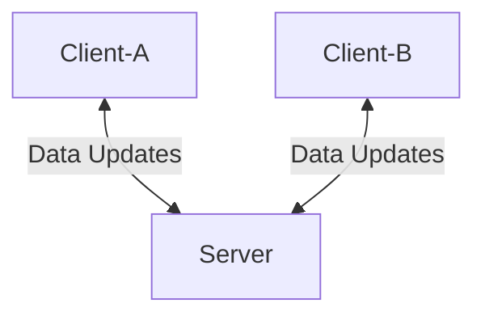

# turbo-guacamole-py

## Project Overview

This project is inspired by [turbo-guacamole](https://github.com/AnthonyMBonafide/turbo-guacamole)
but written in python for a proof of concept. Turbo Guacamole is a tool that
will allow distributed applications to store cache locally for quick access
while keeping data consistent across distributed systems.

turbo-guacamole-py is a set of python tools which allow distributed
applications to cache data locally(i.e. in-memory) and that data be
in sync with other applications that use the same data. One use case is
a distributed micro-service application with more than one instance running
which needs to utilized cached data. If each instance has its own localized
cache with no knowledge of each other the caches can get out of sync and contain
incorrect data. turbo-guacamole allows all instances to be able to use data close
to the application for fast access and have the data be correct.

## Architecture

There are two components in the architecture:

1. Client - library which keeps the cached data local to the running process
allowing it to be accessed and ensuring the data is consistent with other
associated caches

2. Server - a long running process which manages the data within its own
process. This serves as the source of truth to the data and ensures that
clients which are associated have the same data.

There can be many clients within a system, where each client is an instance of
the cache all of which are in sync. The role of a client is to keep a copy of
the data which is being managed within the server. This allows the user to
access the data quickly without having to worry about the data being out-of-date

The role of the server is to be the central authority for the data. The server
ensures that the data is correct and to communicate changes between clients to
ensure that each client has a correct copy of the data.

### Example Scenario

An instance of Turbo Guacamole is running in server mode. The server is
listening for incoming requests from clients. When a new connection request
is accepted it is upgraded to a web-socket and the connection remains open
to either receive updates from the client or push updates to the client.

An instance of Turbo Guacamole in client mode connects to the server.
After the web-socket connection is established, the server sends all
the data it has to the client. The client then populates its cache. At this
point the client and server are in sync. The user(running application) decides
to add a value to its local cache. The client sends the data to the server and
adds it to its cache(not necessarily in that order). At this point the server
and client are in sync. A client instance is started and connects to the
server, upon startup the server sends all its data to the new client and the
new client stores it in its cache. At this point the server and two clients
are in sync. User interacting with client #1 updates its cache(creates new data
, or updates/deletes existing data). The client sends the update to the server
and the server updates its cache, as well as sends the message to client #2.
Client #2 updates its cache according to the message and the clients and server
are in sync.

### Additional Thoughts

1. The server can store the information in a format that is different from the
clients since it does not need to access the data and use it programmatically like
a client would. For example, a user might want to pull a `Person` class out
of the cache to perform some logic. On the other hand the server only holds the
data to communicate it out to clients. Therefore, it can hold data in a simpler
format and does not need to deserialize the data, which would save on processing.

2. Clients should deserialize the data from the server and hold objects in its
cache for quick retrieval and processing

3. Not really sure on the communication mechinism, but something that is 
persistent and bi-directional would be great.

4. The server should have some APIs so the user can choose to view data in the
cache as well as make changes(i.e. remove, expire, or enter data) which will be
reflected across to all clients.
